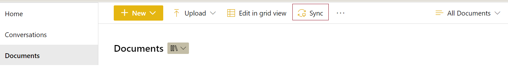

# Python-Automation

## Automation tasks summary
In this repository, I have developed some automations with sharepoint which can be useful for a daily repititive tasks

**NOTE : In all the python files, please Replace sharepoint/sql/Azure BLOB/local drive path with your own credentials**

1. On this file, **AZF_Blob_local.py** you will find below summary & steps to follow
**Automation summary**  - To download the pdf files from blob into local drive
  * STEP1: first to connect BLOB with the variables values
  * STEP2: Try to download the files on python memory that are available under specified container
           with the help of threadpool (it can download 10 files at a times)

2. On this file, **Sharepoint_to_Sql.py** you will find below summary & steps to follow
**Automation summary**  - Download the excel from sharepoint & move the data to sql DB table
  * Step1 : Define sharepoint link/username/password
  * Step2 : connect to SQL
  * Step3 : Authenticate sharepoint using sharepy
  * Step4 : Download Excel to local drive from sharepoint
  * Step5 : Do some conditional filtering, data manipulation with the downloaded excel
  * Step6 : create a dataframe
  * Step7 : Finally, move the dataframe to SQL DB

3. On this file, **sharepoint_nested_folders_list.py** you will find below summary & steps to follow
**Automation summary**  - To get the list of all nested folders created on the sharepoint into excel
  * Step1 : Before you copy/paste the below code, you should sync your sharepoint repository with your local drive
  
  

  * Then, proceed with the steps that I mentioned on the code